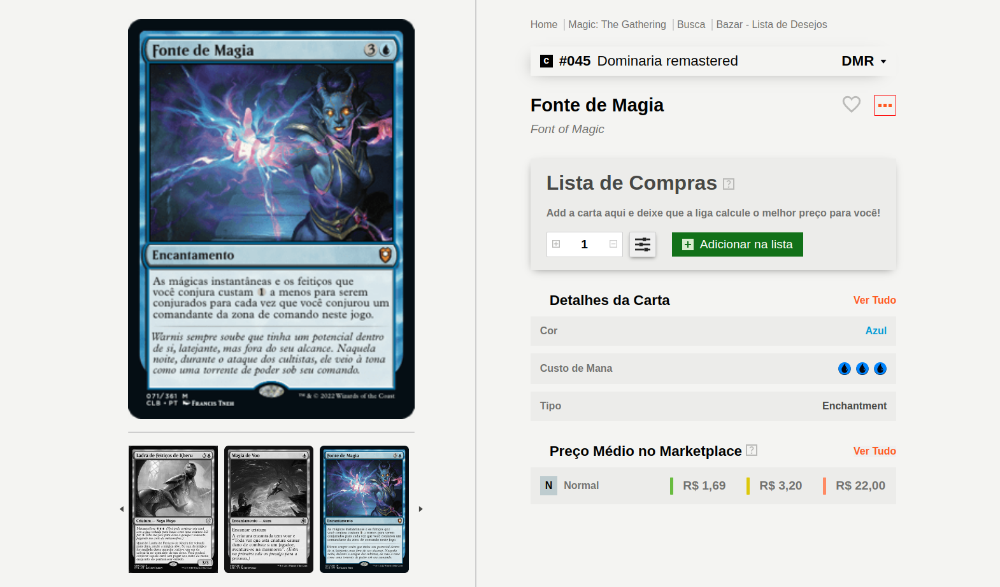

# LigaMagic:test

## Table of contents

- [Overview](#overview)
  - [Screenshot](#screenshot)
  - [Links](#links)
- [My process](#my-process)
  - [Built with](#built-with)
- [Author](#author)

## Overview

### Screenshot

### Links

- Live Site URL: [Add live site URL here](https://eu-pedro0ficial.github.io/ligaMagic-teste/)

## My process

### Built with

- Semantic HTML5 markup;
- CSS custom properties;
- Clean Code;
- Flexbox;
- Web responsive design;
- Clean Code;
- Scalable and Modular Architecture for CSS;
- Responsiveness

## Author

- Instagram - [ohpedro0ficial](https://instagram.com/ohpedro0ficial?igshid=ZDdkNTZiNTM=)